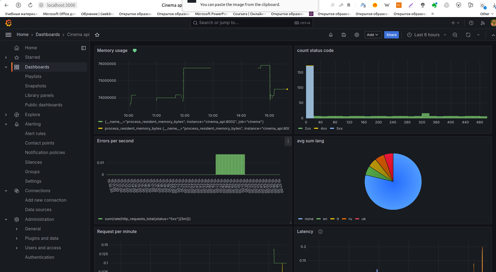
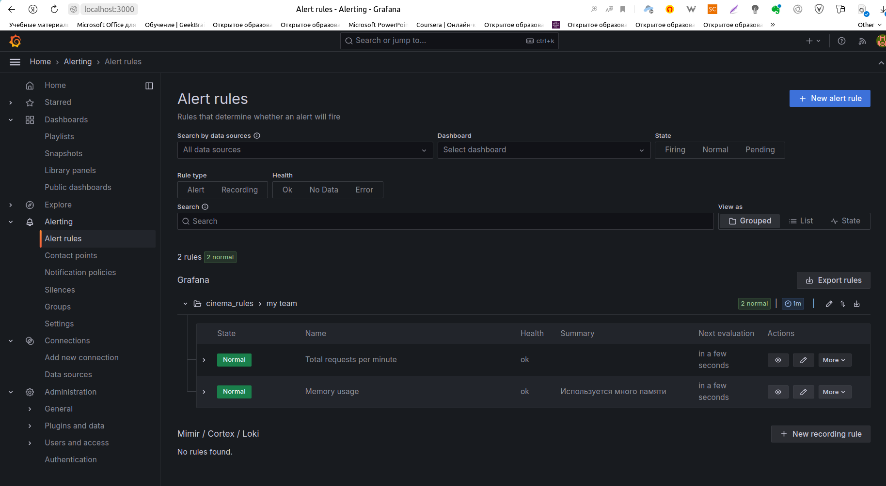
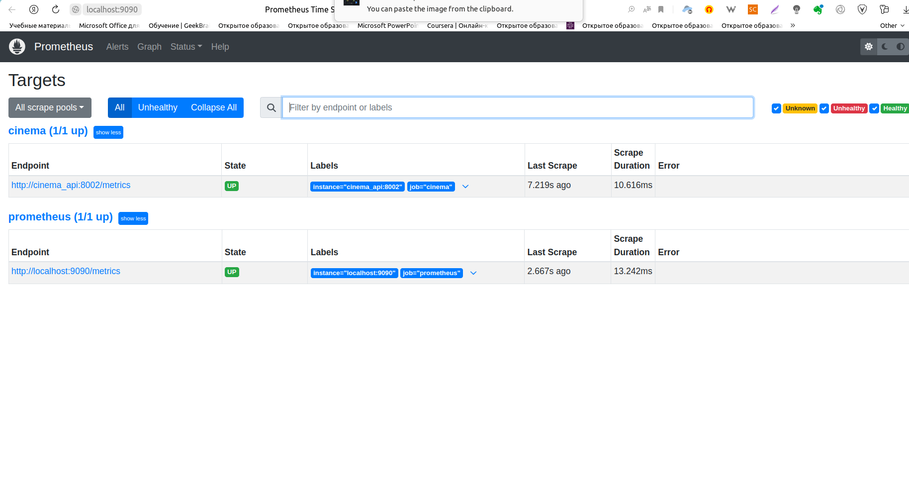

# Проект спринта финального модуля

link to git -> 

Требуется заполнить в .env
`AUTH_GOOGLE_CLIENT_ID=`
`AUTH_GOOGLE_CLIENT_SECRET=`

## Запуск проекта:
```bash
cp env_example .env
```


```bash

docker-compose -f docker-compose.main.yaml -f docker-compose.db.yaml -f docker-compose.elk.yaml up --build
```


```bash
docker exec AuthAPI alembic upgrade head 
```
Заполнение базы данных из sqlite в Postgres

```bash
curl -XGET http://0.0.0.0:8877/migrate
```

# Metrics
Добавили метрики в CinemaApi


